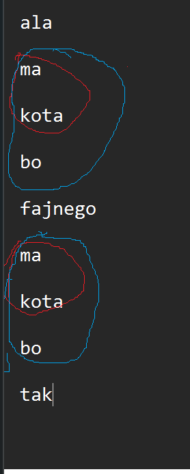
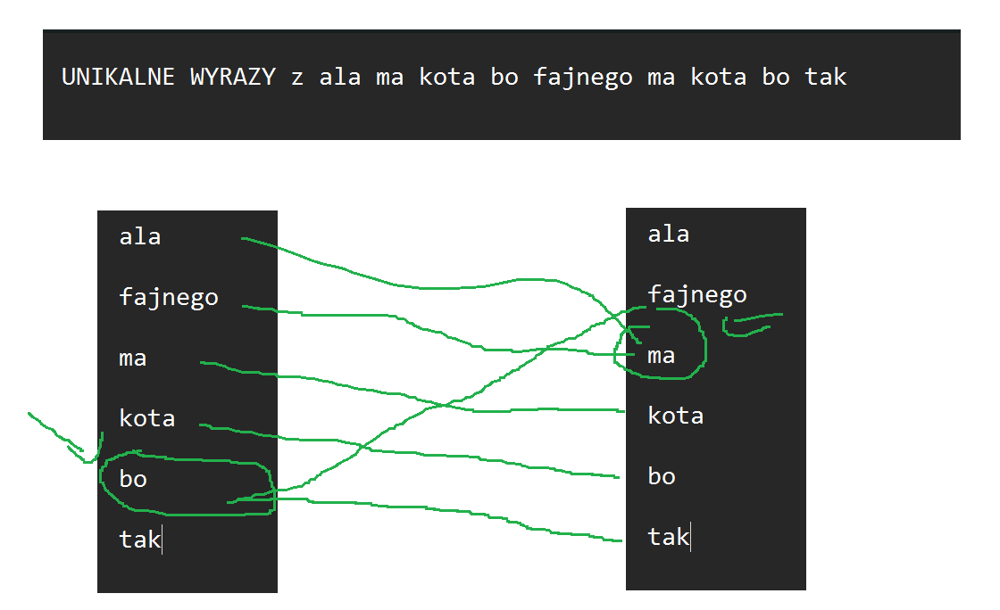

Cel: 
Sprawozdanie czy tekst z manuskryptu wojnicza ma podobieństwo do języka naturalnego (Polskiego) w formacie pdf
Dla tekstu manuskryptu wojnicza dla pierwszych 78 stron i arykułu w języku polskim robimy

Statystyki używane go porównania

1. Ilosć wystąpien
2. Ranga (1 dla najczesciej wystepujacego 2 dla kolejnego itd)
3. iloczyn ilości wystąpień i rangi i powinno wyjść koło stałego (prawo Zipfa)
4. N-gramy
5. Graf dwudzielny 
   
Przykład bi i tri gramu (czerw i niebieski) i zrobić dla kolejnych n-gramów,
tu zostawić tylko tri gram bo ten czerwony zawiera się w nim ( zostawić najdłuższą jednostkę)

Zrobić graf dwudzielny (wypisać unikalne wyrazy i połączyć je do których wychodzą i wypisać wyrazy z których wychodzi najwięcej i do krórych najwięcej wchodzi)

