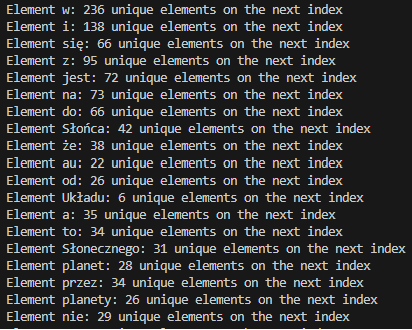
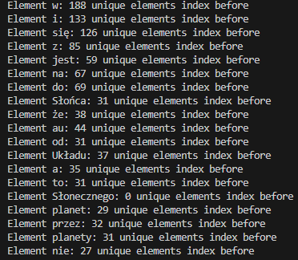
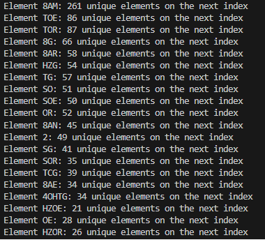
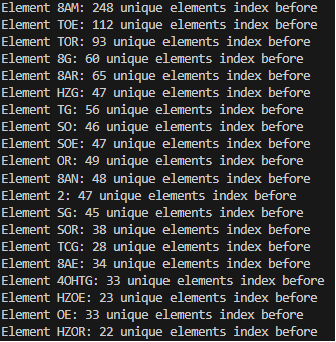

# Porównanie tekstu z wikipedi o układzie słonecznym po polsku oraz manuskryptu Wojnicza

## Ilość słów w artykułach
- Układ słoneczny 6933
- Manuskyprt 6640

## Prawo zipfa i częstotliwość wystąpień
### Manuskrypt
- Najmniejszy iloczyn rangi i częstotliwości to 236
- Największy iloczyn rangi i częstotliwości to 2643
- Maksymalna różnica to 2407
- Odchylenie standardowe dla iloczynu rangi i częstotliwości dla wszystkich to 506
  
### Tekst o układzie słonecznym
- Najmniejszy iloczyn rangi i częstotliwości to 310
- Największy iloczyn rangi i częstotliwości to 2192
- Maksymalna różnica 2407
- Odchylenie standardowe dla iloczynu rangi i częstotliwości dla wszystkich to 413 
  
## n-gramy
### Manuskrypt
- 2-gramy 265
- 3-gramy 10
- 4-gramy brak

### Tekst o układzie słonecznym
- 2-gramy 325
- 3-gramy 97
- 4-gramy 18
- 5-gramy 4
- Jest też jeden 17-gram ale go wykluczamy jako że 17 słów się powtarza w definicji planety i planety karłowatej, przypadek rodzaju tekstu
- Warto zwrócić uwagę że 4 i 5 gramy występują ze względu na jednolitą tematykę tekstu

## Graf dwudzielny

### Dla manuskryptu

| Graf dudzielny statystyki dla słów z których jest najwięcej wychodzących | Graf dudzielny statystyki dla słów z których jest najwięcej wchodzących | 
| ------- | ------- | 
|  |  |

### Dla tekstu o układzie słonecznym

| Graf dudzielny statystyki dla słów z których jest najwięcej wychodzących | Graf dudzielny statystyki dla słów z których jest najwięcej wchodzących | 
| ------- | ------- | 
|  |  |

## Podsumowanie

Tekst w manuskrypcie wojnicza statystycznie co do użycia języka bardzo przypomina tekst o układzie słonecznym z wikipedii. Pojawiające się różnice mogą wynikać z różnej dziedziny i stylu tekstów gdyż na wikipedii jest sporo definicjii a tekst manuskryptu można przypuszczać że ma związek z zielarstwem lub opisem roślin przedstawionych na rysunkach. Moim zdaniem ktoś w końcu roszyfruje ten tekst.

link do repzoyzrorium